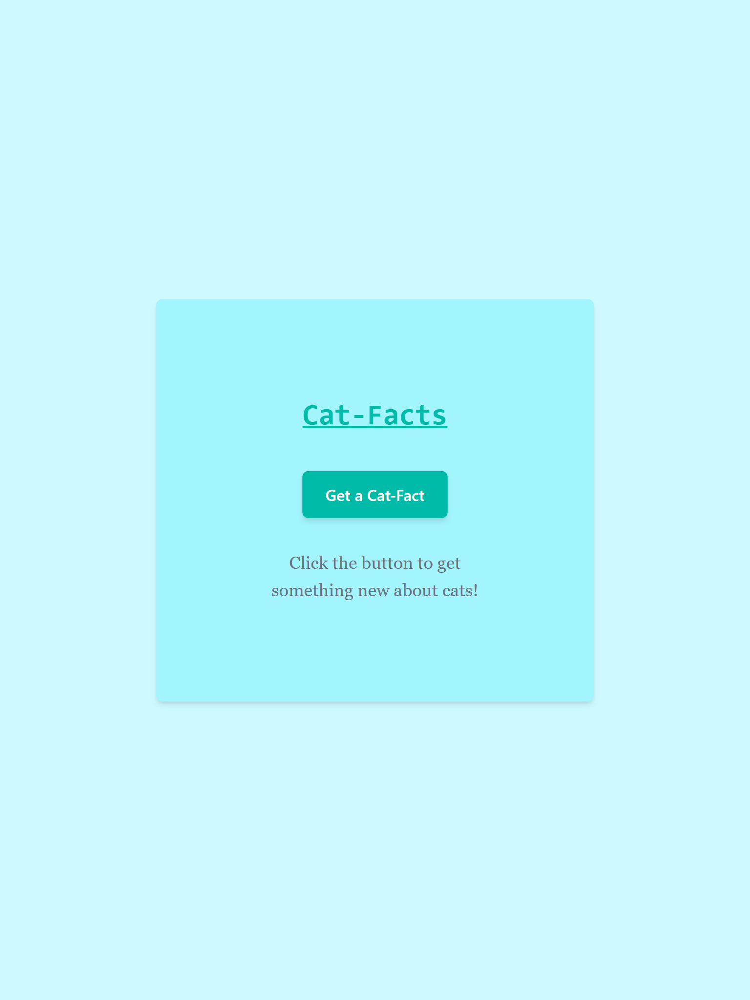
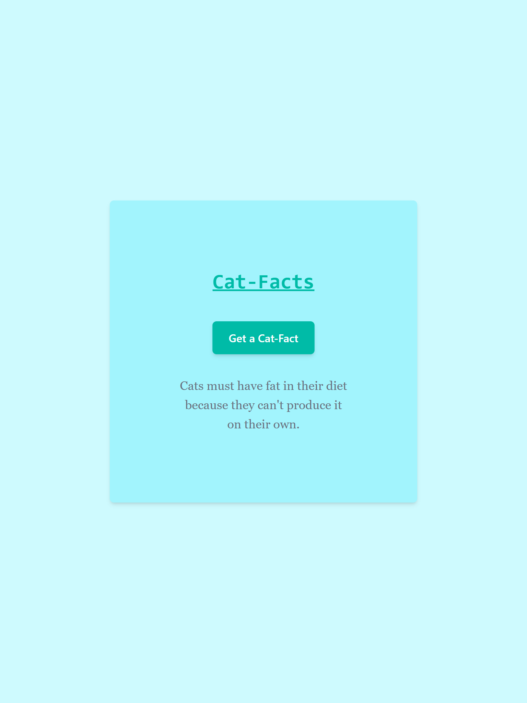

# Cat-Facts App

A simple and fun React application that fetches random cat facts from an external API using **Axios**. Styled beautifully using **Tailwind CSS**.

## ✨ Features

- Fetches a random cat fact with the click of a button.
- Uses Axios for API requests.
- React functional components and hooks (`useState`) for state management.
- Clean and modern UI using Tailwind CSS.

## 🔧 Tech Stack

- ⚛️ React (Functional Components)
- 📦 Axios
- 🎨 Tailwind CSS

## Screenshots

- Starting Page
  

- After Clicking the button
  

## Demo Link

[live Demo](https://r-react-catfactsapp.netlify.app/)
